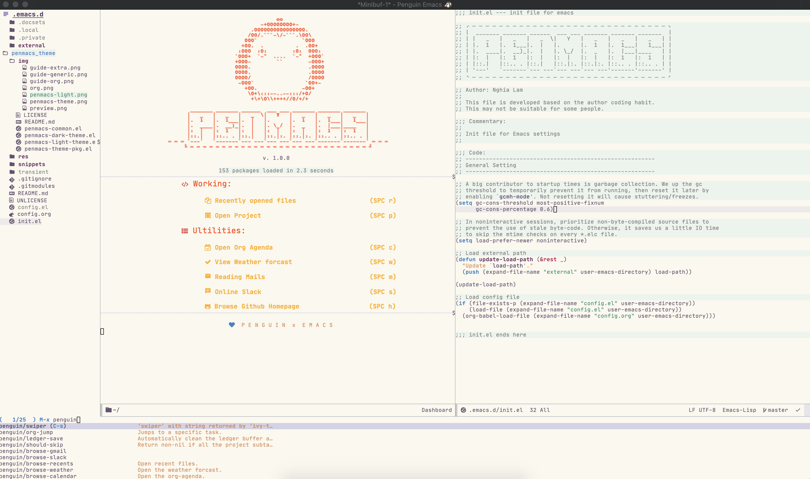
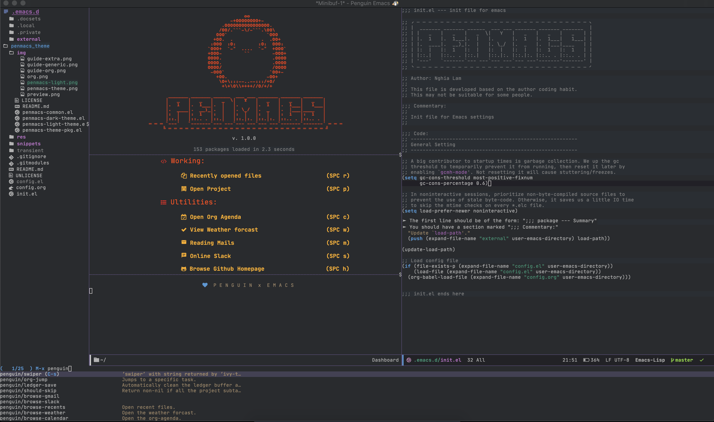

# Penmacs-theme (Fork from Spacemacs-theme)

Penmacs theme is an Emacs color theme that forked from spacemacs theme.
The theme comes with dark and light variants and it should work well with 256 color terminals.

## Screenshots




## Highlights

The theme has good support for org mode.


## Installation

You can install it from MELPA by:

```
M-x package-install RET penmacs-theme
```

## Supported modes

Some of the supported modes are:

* calfw
* company
* ein
* erc
* ESS modes (users may want to customize the variables ess-R-font-lock-keywords and inferior-ess-r-font-lock-keywords)
* gnus
* helm
* ido
* info
* ledger
* magit
* mu4e
* neotree
* org
* and others :) more are coming!

## Customizations

The theme has some options that can be tweaked via `M-x customize`:

* `penmacs-theme-comment-bg`:

This toggles a background color for the comment lines.

* `penmacs-theme-comment-italic`:

This toggles italics for comments and will also add a lighter color to it. It is recommended to disable `penmacs-theme-comment-bg` if you turn this option on for better contrast.

* `penmacs-theme-keyword-italic`:

This toggles italics for keywords.

* `penmacs-theme-org-agenda-height`:

This toggles the use of varying org agenda heights.

* `penmacs-theme-org-bold`:

This toggles bold text for org headings.

* `penmacs-theme-org-height`:

This toggles the use of varying org headings heights.

* `penmacs-theme-org-highlight`:

This toggles highlighting of org headings.

* `penmacs-theme-org-priority-bold`:

This toggles bold text for priority items in agenda view.

* `penmacs-theme-custom-colors`:

This allows for specifying a list of custom colors to override penmacs theme colors. More details in the next section.

* `penmacs-theme-underline-parens`:

This toggles the underline of matching parens when using `show-paren-mode` or similar.

### Override theme's colors

The theme can be customized by overriding one of the theme local variables by setting a list in the `penmacs-theme-custom-colors` variable.
Here's a list of all the local variables and roles:

| var           | role                                                                                              |
|---------------|---------------------------------------------------------------------------------------------------|
| act1          | One of mode-line's active colors.                                                                 |
| act2          | The other active color of mode-line.                                                              |
| base          | The basic color of normal text.                                                                   |
| base-dim      | A dimmer version of the normal text color.                                                        |
| bg1           | The background color.                                                                             |
| bg2           | A darker background color. Used to highlight current line.                                        |
| bg3           | Yet another darker shade of the background color.                                                 |
| bg4           | The darkest background color.                                                                     |
| border        | A border line color. Used in mode-line borders.                                                   |
| cblk          | A code block color. Used in org's code blocks.                                                    |
| cblk-bg       | The background color of a code block.                                                             |
| cblk-ln       | A code block header line.                                                                         |
| cblk-ln-bg    | The background of a code block header line.                                                       |
| cursor        | The cursor/point color.                                                                           |
| const         | A constant.                                                                                       |
| comment       | A comment.                                                                                        |
| comment-bg    | The background color of a comment. To disable this, `customize` `penmacs-theme-comment-bg`.     |
| comp          | A complementary color.                                                                            |
| err           | errors.                                                                                           |
| func          | functions.                                                                                        |
| head1         | Level 1 of a heading. Used in org's headings.                                                     |
| head1-bg      | The background of level 2 headings. To disable this, `customize` `penmacs-theme-org-highlight`. |
| head2         | Level 2 headings.                                                                                 |
| head2-bg      | Level 2 headings background.                                                                      |
| head3         | Level 3 headings.                                                                                 |
| head3-bg      | Level 3 headings background.                                                                      |
| head4         | Level 4 headings.                                                                                 |
| head4-bg      | Level 4 headings background.                                                                      |
| highlight     | A highlighted area.                                                                               |
| highlight-dim | A dimmer highlighted area.                                                                        |
| keyword       | A keyword or a builtin color.                                                                     |
| lnum          | Line numbers.                                                                                     |
| mat           | A matched color. Used in matching parens, brackets and tags.                                      |
| meta          | A meta line. Used in org's meta line.                                                             |
| str           | A string.                                                                                         |
| suc           | To indicate success. Opposite of error.                                                           |
| ttip          | Tooltip color.                                                                                    |
| ttip-sl       | Tooltip selection color.                                                                          |
| ttip-bg       | Tooltip background color.                                                                         |
| type          | A type color.                                                                                     |
| var           | A variable color.                                                                                 |
| war           | A warning color.                                                                                  |


There is also explicit colors variables that can be customized:

* aqua
* aqua-bg
* green
* green-bg
* green-bg-s
* cyan
* red
* red-bg
* red-bg-s
* blue
* blue-bg
* blue-bg-s
* magenta
* yellow
* yellow-bg

The `green` and `red` colors have two background versions. The `green-bg` and  `red-bg` are normal light background colors. The `green-bg-s`, `red-bg-s`, and `blue-bg-s` are stronger versions.

Here are some screenshots of the various variables:


If you are using [penmacs](https://github.com/syl20bnr/penmacs), you can put this snippet in your `dotpenmacs/user-init` to override these colors:

```elisp
  (custom-set-variables '(penmacs-theme-custom-colors
                          '((act1 . "#ff0000")
                            (act2 . "#0000ff")
                            (base . "#ffffff"))))
```

This will override `act1`, `act1` and `base` to use the specified colors.

### Use a custom flycheck fringe bitmap

If you don't use penmacs and want to get the same look of flycheck fringe bitmap, you can put the following snippet into your `init.el` (this assumes you are using `use-package`):

```elisp
(use-package flycheck
  :init
  (progn
    (define-fringe-bitmap 'my-flycheck-fringe-indicator
      (vector #b00000000
              #b00000000
              #b00000000
              #b00000000
              #b00000000
              #b00000000
              #b00000000
              #b00011100
              #b00111110
              #b00111110
              #b00111110
              #b00011100
              #b00000000
              #b00000000
              #b00000000
              #b00000000
              #b00000000))

    (flycheck-define-error-level 'error
      :severity 2
      :overlay-category 'flycheck-error-overlay
      :fringe-bitmap 'my-flycheck-fringe-indicator
      :fringe-face 'flycheck-fringe-error)

    (flycheck-define-error-level 'warning
      :severity 1
      :overlay-category 'flycheck-warning-overlay
      :fringe-bitmap 'my-flycheck-fringe-indicator
      :fringe-face 'flycheck-fringe-warning)

    (flycheck-define-error-level 'info
      :severity 0
      :overlay-category 'flycheck-info-overlay
      :fringe-bitmap 'my-flycheck-fringe-indicator
      :fringe-face 'flycheck-fringe-info)))
```

## Like the theme and want to use it in other places?

Then check out this project [base16-builder](https://github.com/auduchinok/base16-builder).
